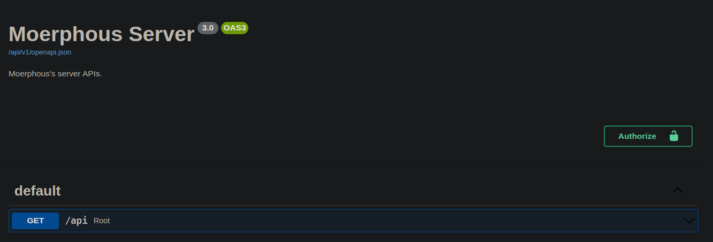
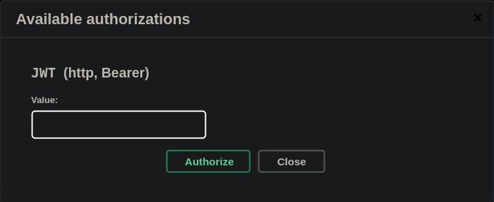

# Moerphous Server

<div align="center">

[](https://results.pre-commit.ci/latest/github/moerphous/moerphous-server/main)
[](https://github.com/PyCQA/pylint)
[](https://github.com/psf/black)
[](http://mypy-lang.org/)
[](https://opensource.org/licenses/MIT)


</div>

A Fully Async-based backend for [Moerphous](https://github.com/moerphous/moerphous).

**Note**: MongoDB is being used to store only the wallet `classic_address` and its `seed` to make transactions work. This project is just a POC for an NFT marketplace backend. In the future, once deployed on the mainnet, MetaMask will be utilized to connect the wallet.

## Table of Contents

- [Development Requirements](#development-requirements)
- [Project Structure](#project-structure)
- [Installation with Make](#installation-with-make)
- [Access Swagger Documentation](#access-swagger-documentation)
- [Access Redocs Documentation](#access-redocs-documentation)
- [Authentication and Authorization](#authentication-and-authorization)
- [Deployments](#deployments)
- [Core Dependencies](#core-dependencies)
- [License](#license)

## Development Requirements

- Make (GNU command)
- Python (>= 3.8)
- Poetry (1.2)

## Project Structure

<details>
<summary><code>❯ tree app</code></summary>

```sh
.
├── auth          # Package contains different config files for the `auth` app.
│   ├── crud.py       # Module contains different CRUD operations performed on the database.
│   ├── router.py     # Module contains different routes for this api.
│   └── schemas.py    # Module contains different schemas for this api for validation purposes.
├── wallets      # Package contains different config files for the `wallets` app.
│   ├── crud.py       # Module contains different CRUD operations performed on the database.
│   ├── models.py     # Module contains different models for ODMs to inteact with database.
│   ├── router.py     # Module contains different routes for this api.
│   └── schemas.py    # Module contains different schemas for this api for validation purposes.
├── nfts      # Package contains different config files for the `nfts` app.
│   ├── crud.py       # Module contains different CRUD operations performed on the database.
│   ├── models.py     # Module contains different models for ODMs to inteact with database.
│   ├── router.py     # Module contains different routes for this api.
│   └── schemas.py    # Module contains different schemas for this api for validation purposes.
├── utils         # Package contains different common utility modules for the whole project.
│   ├── dependencies.py     # A utility script that yield a session for each request to make the crud call work.
│   ├── engine.py           # A utility script that initializes an ODMantic engine and client and set them as app state variables.
│   ├── jwt.py              # A utility script for JWT.
│   ├── mixins.py           # A utility script that contains common mixins for different models.
├── config.py     # Module contains the main configuration settings for project.
├── __init__.py
├── main.py       # Startup script. Starts uvicorn.
└── py.typed      # mypy related file.
```

</details>

## Installation with Make

The best way to configure, install main dependencies, and run the project is by using `make`. So, ensure you have `make` installed and configured on your machine. If it is not the case, head over to [this thread](https://stackoverflow.com/questions/32127524/how-to-install-and-use-make-in-windows) on StackOverflow to install it on windows, or [this thread](https://stackoverflow.com/questions/11494522/installing-make-on-mac) to install it on Mac OS.

Having `make` installed and configured on your machine, you can now run `make` under the root directory of this project to explore different available commands to run:

```sh
make

Please use 'make <target>' where <target> is one of:

venv                     Create a virtual environment
install                  Install the package and all required core dependencies
run                      Running the app locally
deploy-deta              Deploy the app on a Deta Micro
clean                    Remove all build, test, coverage and Python artifacts
lint                     Check style with pre-commit
test                     Run tests quickly with pytest
test-all                 Run tests on every Python version with tox
coverage                 Check code coverage quickly with the default Python
build                    Build docker containers services
up                       Spin up the containers
down                     Stop all running containers
```

### 1. Create a virtualenv

```sh
make venv
```

### 2. Activate the virtualenv

```sh
source .venv/bin/activate
```

### 3. Install dependencies

```sh
make install
```

**Note**: _This command will automatically generate a `.env` file from `.env.example`, uninstall the old version of poetry on your machine, then install latest version `1.2.2`, and install the required main dependencies._

### 4. Setup a MongoDB Atlas account

Head over to [the official website](https://www.mongodb.com/cloud/atlas/signup) to create a MongoDB account and a cluster.

### 5. Set your MongoDB Credentials

Fill in the following environment variables in your .env file accordingly:

```yaml
# Database
MONGODB_USERNAME=
MONGODB_PASSWORD=
MONGODB_HOST=cluster_name.example.mongodb.net
MONGODB_DATABASE=xrpl
```

### 6. Create a Pinata Account

Register an account on [pinata](https://app.pinata.cloud/register), and create a new API under the development tab.

### 7. Set your Pinata Credentials

Set the following environment variable in your `.env` file according to your credentials:

```yaml
# Pinata Cloud
PINATA_API_KEY=
PINATA_API_SECRET=
```

### 8. Generate a secret key

Generate a secret key using OpenSSL and update its env var in the .env file.

```sh
openssl rand -hex 128

afa1639545d53ecf83c9f8acf4704abe1382f9a9dbf76d2fd229d4795a4748712dbfe7cf1f0a812f1c0fad2d47c8343cd1017b22fc3bf43d052307137f6ba68cd2cb69748b561df846873a6257e3569d6307a7e022b82b79cb3d6e0fee00553d80913c1dcf946e2e91e1dfcbba1ed9f34c9250597c1f70f572744e91c68cbe76
```

```yaml
# App config:
JWT_SECRET_KEY=afa1639545d53ecf83c9f8acf4704abe1382f9a9dbf76d2fd229d4795a4748712dbfe7cf1f0a812f1c0fad2d47c8343cd1017b22fc3bf43d052307137f6ba68cd2cb69748b561df846873a6257e3569d6307a7e022b82b79cb3d6e0fee00553d80913c1dcf946e2e91e1dfcbba1ed9f34c9250597c1f70f572744e91c68cbe76
DEBUG=info
```

### 9. Run The Project Locally

```sh
make run
```

**Note**: _You have to set **DEBUG=info** to access the docs._

## Access Swagger Documentation

> <http://localhost:8000/docs>

## Access Redocs Documentation

> <http://localhost:8000/redocs>

## Authentication and Authorization

For development purposes, you can use openapi to interact with the endpoints. To do so, you have to follow the steps below in order:

- Generate a faucet wallet through the `/api/v1/wallet` post endpoint.


- Copy the access token from the response, and use it to authorize openapi with the backend.






As you can notice, the default openapi authorization form has been customized to authenticate wallets using only an access token.

- Now you can interact with any endpoints that require authorization.


## Deployments

### Deploy locally with Compose v2

To run the entire platform, you have to clone the `moerphous` submodule using the following command:

```sh
git submodule update --init --recursive
```

Once that is done, make sure you have [compose v2](https://github.com/docker/compose) installed and configured on your machine, and run the following command to build the predefined docker services(make sure you have a .env file beforehand):

**Using Make**

```sh
make build
```

or simply running:

```
docker compose build
```

Once that is done, you can spin up the containers:

**Using Make**

```sh
make up
```

or running:

```
docker compose up
```

Wait until the client service becomes available:

```sg
moerphous-client-1      | Starting the development server...
```

You can stop the running containers but issuing the following command on a separate terminal session:

```
make down
```

### Deta Micros (Endpoints not working)

You'll need to create a Deta account to use the Deta version of the APIs.

[](https://go.deta.dev/deploy?repo=https://github.com/moerphous/moerphous-server)

#### Deta CLI

Make sure you have Deta CLI installed on your machine. If it is not the case, just run the following command(on a Linux distro or Mac):

```sh
curl -fsSL https://get.deta.dev/cli.sh | sh
```

Manually add `/home/<user_name>/.deta/bin/deta` to your path:

```sh
PATH="/home/<user_name>/.deta/bin:$PATH"
```

Now you can deploy the app on a Deta Micro:

```sh
make deploy-deta
```

You can then use the Deta UI to check the logs and the URL the API is hosted on.

**Notes**:

- _Make sure your `.env` file is being provided with valid env vars values accordingly._

- _The `main.py` file is used as an entry point for Deta. The same goes for `requirements.txt`._

- _Deta Micros are limited to 512MB per deployment._

### Heroku

This button will only deploy the server.

[](https://heroku.com/deploy?template=https://github.com/moerphous/moerphous-server)

#### Heroku CLI (Experimental: Deploy the entire stack)

Note that this approach is not perfect because in the docker world, you should only have one service for each container, and you should use docker-compose to build and run more than two containers(e.g. one for the server and the other one for the client). However, Heroku doesn't support docker-compose with multiple services(except databases and such.). Hence running both services in one container.

To do so, ensure you have already installed and configured the Heroku CLI on your machine. If it is not the case, you can install it on Ubuntu using the following command:

```sh
sudo wget -qO- https://toolbelt.heroku.com/install-ubuntu.sh | sh
```

Now, you need to install the Heroku container registry plugin:

```sh
heroku plugins:install heroku-container-registry
```

Once that is completed, log in to your registry:

```sh
heroku container:login
```

Now, create a Heroku app:

```sh
heroku create <a unique app name>
```

You can list all your apps to verify that your recent app has been created:

```sh
heroku apps
```

Set your env variables in the `.env` file.

Build your container image:

```sh
docker compose -f heroku-compose.yml build
```

Deploy to Heroku:

```sh
heroku container:push web --app <your heroku app name>; heroku logs --tail
```

Once the build and push are completed, you can run the following command in a separate shell to interact with the app:

```sh
heroku open --app=<your app name>
```

You can refer to [heroku dev center](https://devcenter.heroku.com/articles/local-development-with-docker-compose) for more info. Happy Herokuing!


## Core Dependencies

The following packages are the main dependencies used to build this project:

- [`python`](https://github.com/python/cpython)
- [`fastapi`](https://github.com/tiangolo/fastapi)
- [`uvicorn`](https://github.com/encode/uvicorn)
- [`pydantic`](https://github.com/pydantic/pydantic)
- [`odmantic`](https://github.com/art049/odmantic)
- [`xrpl-py`](https://github.com/XRPLF/xrpl-py)
- [`pinatapy`](https://github.com/Vourhey/pinatapy)
- [`PyJWT`](https://github.com/jpadilla/pyjwt)
- [`passlib`](https://passlib.readthedocs.io/en/stable/index.html)
- [`python-multipart`](https://github.com/andrew-d/python-multipart)

## License

This project and the accompanying materials are made available under the terms and conditions of the [`MIT LICENSE`](https://github.com/moerphous/moerphous-server/blob/main/LICENSE).
